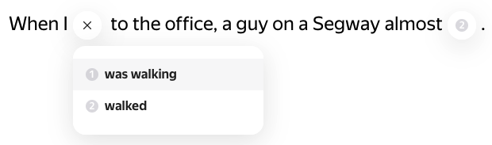

# UI for Creating "fill-in-the-gaps" Exercises
Provide an interface for creating exercises like this:

The tutor/admin creates a sentence with one or more gaps with variants. The student sees the UI, chooses the variant, and checks it.
